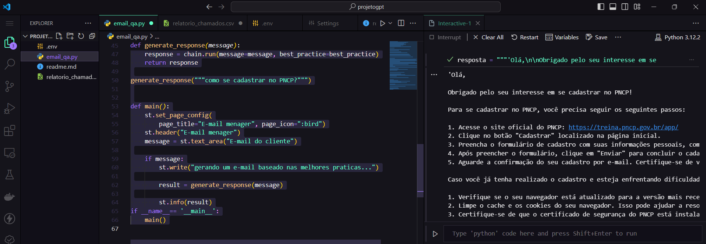

# E-mail Manager
Este é um projeto para responder e-mails automaticamente com base em modelos pré-definidos e histórico de conversas.

# Instalação
Para executar este projeto, você precisará ter o Python instalado em sua máquina. Em seguida, siga estas etapas:

Clone este repositório para sua máquina local:

git clone https://github.com/seu-usuario/projetogpt.git
## Acesse o diretório do projeto:

cd projetogpt
## Instale as dependências usando o pip. Certifique-se de estar no ambiente virtual adequado, se estiver usando um:

pip install -r requirements.txt
Uso
## Após instalar as dependências, você pode executar o aplicativo usando o seguinte comando:

arduino

streamlit run email_qa.py
Isso abrirá o aplicativo em seu navegador padrão. Você poderá inserir o e-mail do cliente e obter uma resposta gerada automaticamente com base em modelos pré-definidos e histórico de conversas.

# Contribuindo
Se desejar contribuir com este projeto, fique à vontade para abrir uma issue ou enviar um pull request com suas sugestões e melhorias.

# Licença
Este projeto está licenciado sob a Licença MIT - veja o arquivo LICENSE.md para mais detalhes.

# Contato
Se precisar de ajuda ou tiver alguma dúvida, sinta-se à vontade para entrar em contato comigo através do meu e-mail: danrleimentalista@gmail.com.

Esse é um exemplo básico e genérico de como você pode estruturar seu README.md para explicar o funcionamento do seu projeto no GitHub. Certifique-se de personalizá-lo de acordo com as necessidades específicas do seu projeto.

# Executando no Visual Studio Code
Se você preferir trabalhar com o Visual Studio Code, siga estas etapas adicionais para configurar o ambiente:

Baixe e instale a extensão do Jupyter para o VS Code. Você pode encontrar a extensão na Visual Studio Code Marketplace.

Após instalar a extensão, abra o VS Code e vá para File > Preferences > Settings.

Na barra de pesquisa das configurações, digite "jupyter" para filtrar as opções.

Ative a opção Jupyter > Interactive Window > Text Editor: Execute Selection. Isso permite que você execute o código selecionado em um arquivo Python diretamente na janela interativa do Jupyter quando pressionar Shift+Enter.

Com essas configurações, você poderá executar o código Python do projeto diretamente no VS Code usando a extensão do Jupyter.